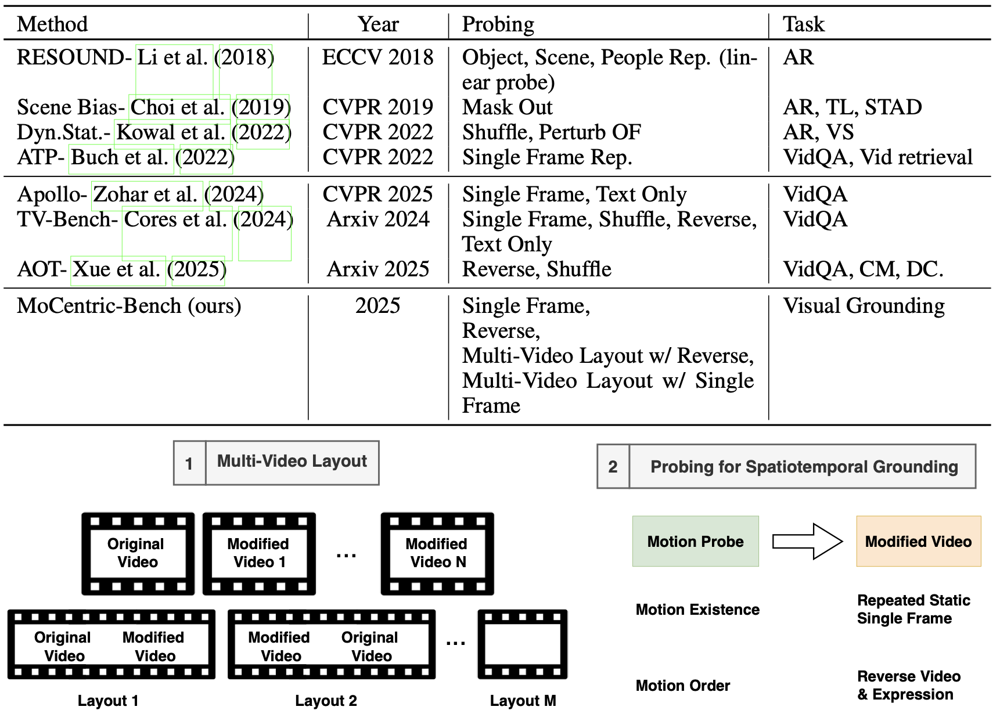
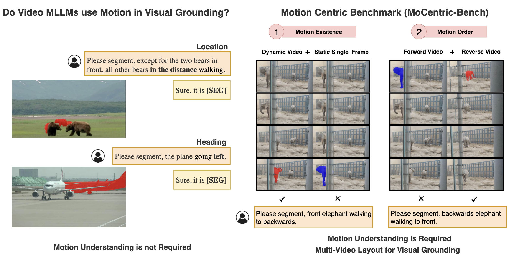

# PixFoundation-2.0: Do Video Multi-Modal LLMs Use Motion in Visual Grounding?

Official implementation of our work PixFoundation 2.0.
* This codebase only documents the motion existence and motion ordering probes and the evaluation of three SOA video MLLMs: RGA, Sa2VA and GPT-5.0 to showcase the reproducability of the major evaluation and benchmarking part of our work. The motion-centric adaptation will be made publicly available upon acceptance.

## Motion-Centric Benchmark (MoCentric-Bench)

<div align="center">
<br><br>
</div>

## Benchmarking Pixel-level video MLLMs for visual grounding (RefVOS)

<div align="center">
<br><br>
</div>

<div align="justify">
Multi-modal large language models (MLLMs) have shown impressive generalization across tasks using images and text modalities. While their extension to video has enabled tasks such as video question answering and video captioning, their pixel-level visual grounding abilities are less studied. In this work, we raise the pertinent question of whether motion is used in pixel-level visual grounding and whether video MLLMs can segment objects based on natural language expressions describing their motion patterns. We identify the shortcomings in the current benchmarks, where we show that a single frame can often suffice for capturing the referring expression without any temporal reasoning. To address this, we introduce novel motion-centric probing, particularly designed for the visual grounding task, to study video MLLMs' ability to identify true motion from a fake one and their ability to grasp the ordering of motion. Consequently, we introduce MoCentric-Bench, a motion-centric benchmark designed to evaluate video MLLMs based on their ability to capture the interaction between motion and language, rather than relying primarily on static cues. We further establish strong single-image baselines that either match or surpass prior methods. Finally, we explore a simple motion-centric adaptation that provides state-of-the-art performance on our MoCentric-Bench.
</div>

## Installation

* Clone the repository recursively to include the submodules
```
git clone --recursive ANON_GIT_URL
```
* Create conda environment
```
conda create --name pixfoundation2 python=3.10
conda activate pixfoundation2
```
* Install the base requirements for evaluations
```
pip install -r requirements.txt
```
* Setup detectron2 for some utilities used (**Optional**)
```
git clone https://github.com/facebookresearch/detectron2.git
python -m pip install -e detectron2
```
* Follow installation setup for each model you are evaluating, refer to their README and if necessary create its separate conda env.
* Refer to scripts/run_X.sh for each model X script and modify the conda environment if needed or use the common pixfoundation2

## Synthetic Dataset Setup
* Download [MeVIS](https://huggingface.co/datasets/FudanCVL/MeViSv2).
* Generate the multi-video-layout. Layouts l2, l3
```
python data/create_benchmark_mevis.py --config-file configs/mevis.yaml --dataset_root DATA_ROOT --frames_sel_file data/mevis_keyframes.csv --output_dir OUT_DIR
python data/create_benchmark_mevis.py --config-file configs/mevis.yaml --dataset_root DATA_ROOT --frames_sel_file data/mevis_keyframes.csv --output_dir OUT_DIR --left_flag
python data/create_benchmark_mevis.py --config-file configs/mevis.yaml --dataset_root DATA_ROOT --output_dir OUT_DIR --reverse_flag
python data/create_benchmark_mevis.py --config-file configs/mevis.yaml --dataset_root DATA_ROOT --output_dir OUT_DIR --reverse_flag --left_flag
```
* Move our reverse expressions under data/meta_expressions_reverse_filtered.json to the valid_u subset path.

* The final MeVIS directory is as follows:
```
|--- MeVIS
   |--- train
      |--- JPEGImages
      |--- mask_dict.json
      |--- meta_expressions.json
   |--- valid_u
      |--- JPEGImages
      |--- mask_dict.json
      |--- meta_expressions.json
      |--- meta_expressions_reverse_filtered.json
   |--- valid_u_mocentric_tile_single
      |--- JPEGImages
   |--- valid_u_mocentric_tile_single_left
      |--- JPEGImages
   |--- valid_u_mocentric_tile_reverse
      |--- JPEGImages
   |--- valid_u_mocentric_tile_reverse_left
      |--- JPEGImages
```

* Visualize the synthetic dataset with the segmentation masks
```
python datasets_/test_loaders.py --config-file configs/mevis.yaml --dataset_root DATA_ROOT --dataset_split mevis_val_mocentric_tile_single --dataset_mask_path DATA_ROOT/valid_u/mask_dict.json --dataset_exp_path DATA_ROOT/valid_u/EXPRS_JSON --out_dir OUT_DIR --save_vis
```
* You can follow similar procedure to [Molmo2Track](https://huggingface.co/datasets/allenai/Molmo2-VideoTrackEval).

## Evaluation
* Due to the anonymity we only provide the modified Sa2VA loader for our benchmarking, modify accordingly and use the following SHA commit
```
git checkout c94a50776e61515d72c5fe1839d3676e27082237
mv datasets_/sa2va_refVOS.py projects/llava_sam2/evaluation/dataset/refVOS.py
```

* Run common bash script to run the benchmarking
```
cd scripts
bash run_all.sh
```

# References

